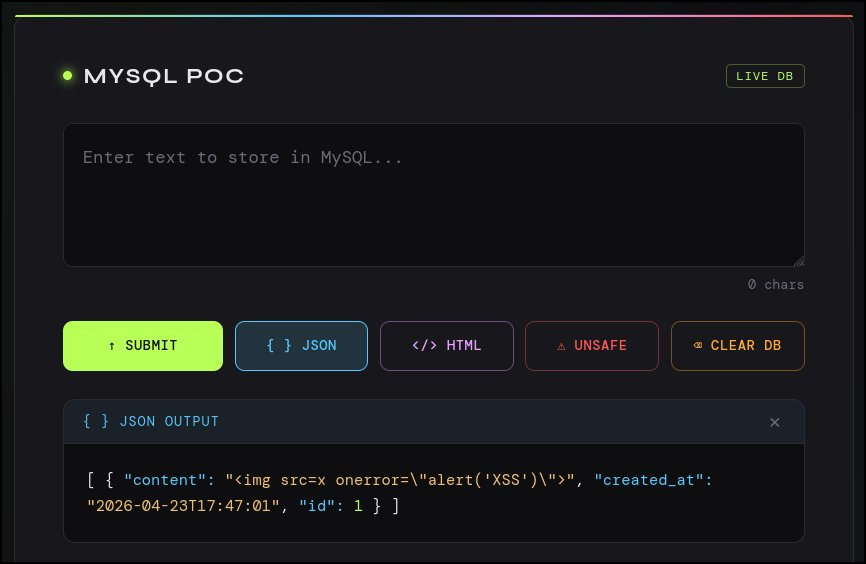
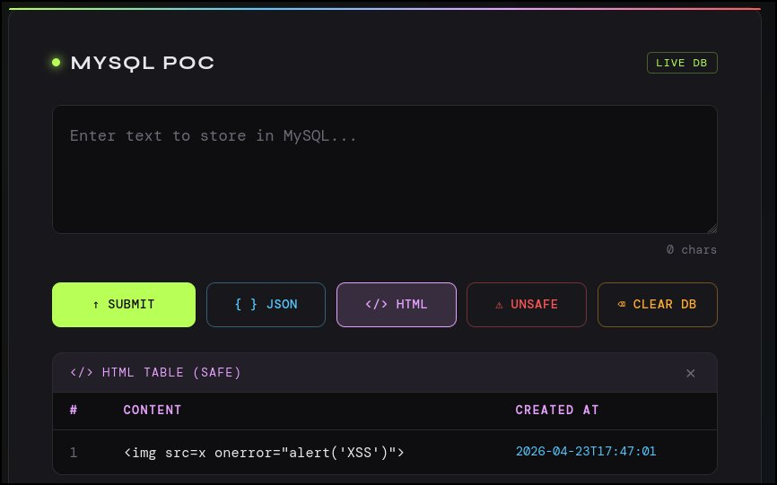
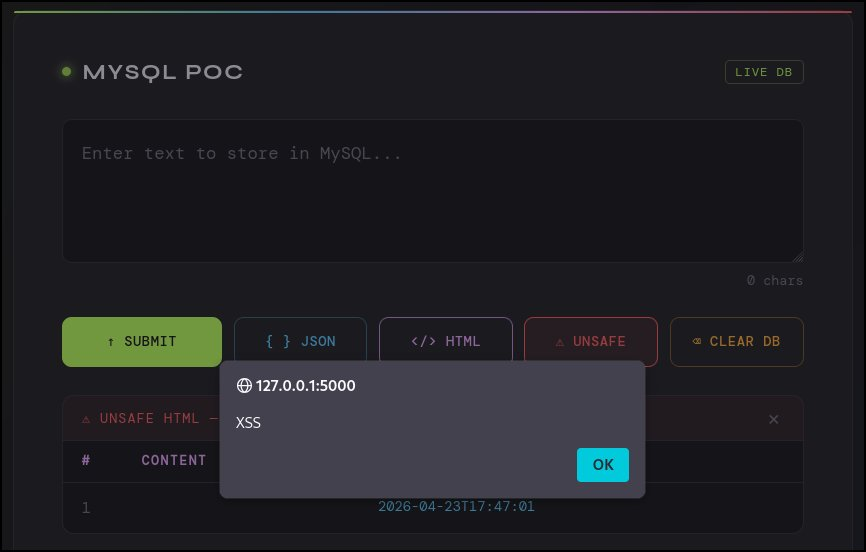

# Stored XSS + MySQL PoC

A minimal Flask + MySQL proof-of-concept demonstrating how user input is stored raw in a database and how the safety of that data depends entirely on how it is rendered — not how it is stored.

Built for educational and demonstration purposes.

---

## What It Demonstrates

- User input is saved to MySQL **without any sanitization**
- The same raw data can be rendered three different ways:
  - **JSON** — safe by nature (data format, no execution context)
  - **Safe HTML** — escaped at render time using output encoding
  - **Unsafe HTML** — injected directly into the DOM, enabling stored XSS
- **Stored XSS** — a payload written once executes for anyone who views the unsafe output
- **Output encoding** is the correct defense, not input sanitization

---

## Project Structure

```
.
├── app.py                  # Flask backend
├── requirements.txt        # Python dependencies
├── setup.sql               # MySQL database + user setup
├── .gitignore
├── screenshots/            # Demo screenshots
└── templates/
    ├── index.html          # Main UI (textarea + all buttons)
    └── entries.html        # Standalone HTML table view
```

---

## Setup

### 1. Install MySQL / MariaDB

**Debian / Kali / Ubuntu:**
```bash
sudo apt install mariadb-server -y
sudo service mariadb start
```

### 2. Create the database and user

```bash
sudo mysql -u root < setup.sql
```

This creates:
- Database: `poc_db`
- User: `poc_user` / password: `poc_password`
- Table: `entries` (auto-created by `app.py` on first run)

### 3. Set up Python environment

```bash
python3 -m venv venv
source venv/bin/activate
pip install -r requirements.txt
```

### 4. Run the app

```bash
python app.py
```

Open **http://localhost:5000** in your browser.

---

## XSS Demo

### Attack String

Submit this payload using the text box:

```html

```

This works because when injected into the DOM via `innerHTML`, the browser loads the broken image, fires the `onerror` event, and executes the JavaScript. Note that `<script>` tags injected via `innerHTML` are **not** executed by browsers — event handler attributes like `onerror` bypass this restriction.

### Step-by-Step

1. Paste the attack string into the text box and click **↑ SUBMIT**
2. Click **{ } JSON** — payload is visible as a raw string, safe
3. Click **</> HTML** — payload is escaped and rendered as harmless text
4. Click **⚠ UNSAFE** — payload executes, alert fires

---

## Screenshots

### 1. JSON Output — payload stored and returned as raw string

The quotes inside the payload are escaped (`\"`) because JSON requires it. This is JSON serialization, not security — the underlying value in the database is the unescaped string. You can verify this directly:

```bash
mysql -u poc_user -ppoc_password poc_db -e "SELECT content FROM entries\G"
```



---

### 2. Safe HTML — output encoding neutralizes the payload

The `<` and `>` characters are converted to `&lt;` and `&gt;` before being inserted into the DOM. The browser renders them as visible text rather than interpreting them as HTML tags. The database still holds the raw payload — it is neutralized at render time only.



---

### 3. Unsafe HTML — stored XSS executes

The same data is injected directly into `innerHTML` with no escaping. The browser parses it as real HTML, the broken image triggers `onerror`, and the JavaScript executes. The alert shows `127.0.0.1:5000` confirming it ran in the page context.



---

## Why Does JSON Show Escaped Quotes?

When the payload `` is serialized to JSON, the double quotes inside become `\"`:

```json
"content": ""
```

This is **JSON encoding**, not security filtering. JSON requires quotes inside strings to be escaped so the format stays valid and parseable. When JavaScript receives and parses this JSON, it reconstructs the original unescaped string perfectly — which is exactly what gets injected into the DOM in the unsafe view.

To see the raw unescaped value as it actually sits in MySQL:

```bash
mysql -u poc_user -ppoc_password poc_db -e "SELECT id, content FROM entries\G"
```

Output will show:
```
*************************** 1. row ***************************
     id: 1
content: 
```

No escaping. Exactly what was typed.

---

## Buttons Reference

| Button | Route | Behavior |
|---|---|---|
| **↑ SUBMIT** | `POST /submit` | Saves raw input to MySQL, no sanitization |
| **{ } JSON** | `GET /entries/json` | Returns data as JSON — safe by nature |
| **</> HTML** | inline | Renders with output encoding — safe by design |
| **⚠ UNSAFE** | inline | Renders raw into `innerHTML` — XSS executes |
| **⌫ CLEAR DB** | `POST /clear` | Deletes all rows, resets auto-increment |

---

## Environment Variables

Override DB credentials without editing code:

| Variable | Default |
|---|---|
| `DB_HOST` | `localhost` |
| `DB_USER` | `poc_user` |
| `DB_PASS` | `poc_password` |
| `DB_NAME` | `poc_db` |

Example:
```bash
DB_USER=myuser DB_PASS=mypass python app.py
```

---

## Key Takeaway

The vulnerability is not in how data is **stored** — it is in how data is **rendered**.

The same dirty string in the database is harmless when JSON-encoded or HTML-escaped, and dangerous when dumped raw into the DOM. Output encoding at render time is the correct defense. Input sanitization alone is insufficient because you cannot always predict every context in which data will be displayed.

---

## Disclaimer

This project is intentionally vulnerable. Run it only on localhost or in an isolated environment. Do not deploy it publicly.
